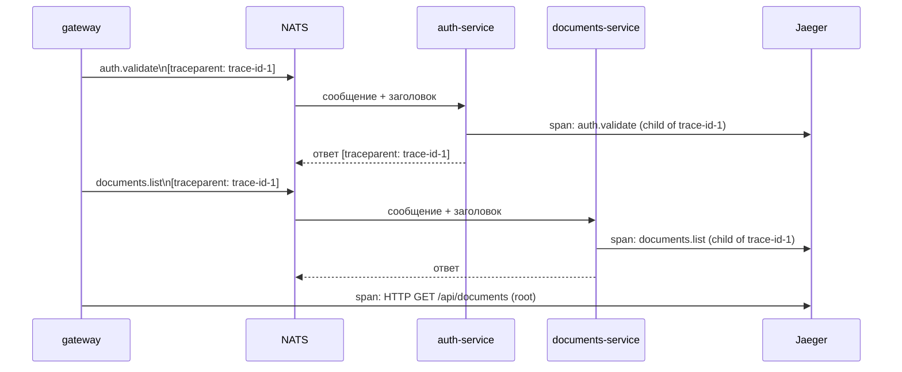
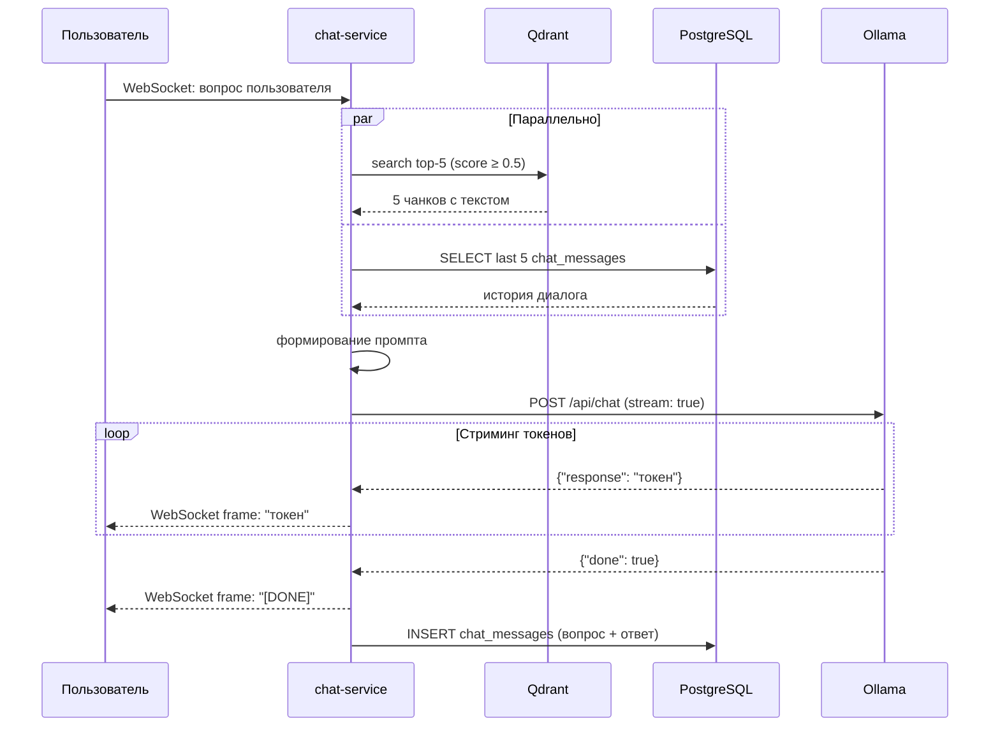

Теперь вижу полную структуру документа. Глава 3 в содержании обозначена как: 3.1 Реализация серверной части, 3.2 Реализация клиентской части, 3.3 Реализация подсистемы индексации и интеллектуального поиска, 3.4 Функциональное тестирование системы. Все четыре раздела пустые (страница 51). Читаю репозиторий для деталей реализации.Отлично, теперь у меня полная картина: структура документа, содержимое репозитория, статья с деталями реализации. Пишу главу 3 полностью — с диаграммами, трассировкой к требованиям ФТ/НФТ и тест-кейсами.

---

## 3 РЕАЛИЗАЦИЯ И ТЕСТИРОВАНИЕ СИСТЕМЫ

Вторая глава настоящей работы установила проектные решения платформы «Цифровой Райбекас»: архитектуру сервисов, схему баз данных и технологический стек. Данная глава посвящена реализации — переходу от проектных схем к работающему программному коду — и последующей верификации реализованной функциональности посредством функционального тестирования. Разделы 3.1–3.3 рассматривают ключевые технические решения, принятые при реализации серверной части, клиентской части и подсистемы индексации соответственно. Раздел 3.4 содержит описание метода тестирования и результаты проверки соответствия реализации требованиям ФТ-01 – ФТ-19.

---

### 3.1 Реализация серверной части

**Организация кодовой базы и инструменты качества.** Серверная часть платформы реализована в виде Go-монорепозитория с пятью сервисами и четырьмя общими библиотеками, объединёнными единым Go Workspace. В корне репозитория располагаются конфигурационные файлы инструментов качества кода: `.golangci.yml` — конфигурация линтера golangci-lint, объединяющего более двадцати статических анализаторов, и `.mockery.yml` — конфигурация генератора моков mockery. Все NATS-обработчики в сервисах тестируются с моками репозиториев, сгенерированными через mockery по интерфейсам из слоя `internal/repository/`.

**Реализация аутентификации (auth-service, users-service).** Auth-service реализует двухтокенную схему JWT. Access-токен имеет время жизни 15 минут и передаётся клиенту через HttpOnly-куки. Refresh-токен имеет расширенное время жизни и хранится аналогичным образом, дополненный cookie-отпечатком (fingerprint) — хэшем от User-Agent и IP клиента. При каждой валидации access-токена через NATS-топик `auth.validate` шлюз также передаёт fingerprint; auth-service сверяет его с хэшем, сохранённым в Redis, что делает перехваченный токен непригодным без соответствующего fingerprint-куки. WebSocket-соединения используют `skip_fingerprint: true` ввиду иной природы транспорта. Пароли хэшируются алгоритмом bcrypt с фактором работы 12, что соответствует требованию НФТ-04.

Взаимодействие auth-service и users-service реализовано через события NATS. Users-service, принимая решение администратора об утверждении заявки, публикует событие `admin.registration.approved`, содержащее логин и уже хэшированный пароль из исходной заявки. Auth-service, подписанный на этот топик, создаёт учётную запись. Такое разделение позволяет users-service ничего не знать о реализации хранения паролей — он работает исключительно с жизненным циклом заявок.

**Реализация documents-service.** Ключевой нетривиальной задачей при реализации сервиса документов является механизм сохранения фрагментов с постоянными ссылками (ФТ-12, ФТ-13). При сохранении фрагмента сервис генерирует UUID-токен, не зависящий от содержимого документа и его положения в тексте. URL вида `/fragments/{uuid}` остаётся действительным независимо от последующего редактирования документа. При переходе по ссылке сервис загружает текущее содержимое документа из MinIO и выполняет поиск точного вхождения сохранённого текста. Если точное вхождение не найдено (документ был изменён), применяется нечёткий поиск: из сохранённого фрагмента и его контекста формируется поисковый запрос, выполняется поиск наиболее близкого совпадения. Если близкое соответствие обнаружено — пользователь перенаправляется к нему с подсветкой; если нет — поле `is_stale` в таблице `fragments` устанавливается в `true`, пользователю отображается сохранённая копия текста с соответствующим уведомлением. Данная логика реализует требования ФТ-12 и ФТ-13.

Полнотекстовый поиск (ФТ-09) реализован на уровне PostgreSQL через тип `tsvector` и оператор `@@`. При загрузке документа триггер вычисляет значение `ts_vector` из конкатенации заголовка, содержимого документа, имён авторов и тегов с весовыми коэффициентами (заголовок — вес A, содержимое — вес B, теги — вес C) с использованием конфигурации `russian`. По столбцу `ts_vector` создан индекс GIN.

Transactional Outbox реализован следующим образом: в той же транзакции, что и операция над документом (`INSERT`/`UPDATE`/`DELETE`), в таблицу `outbox_events` добавляется запись с топиком и JSON-payload события. Отдельная горутина-релей опрашивает таблицу с интервалом 500 мс, публикует необработанные события в NATS JetStream и помечает их как обработанные. Атомарность записи гарантирует, что документ и событие либо сохранены вместе, либо не сохранены вовсе — промежуточных состояний не возникает.

**Реализация chat-service.** Chat-service реализует WebSocket-соединения через стандартную библиотеку gorilla/websocket. При установке соединения шлюз валидирует токен через NATS (с `skip_fingerprint: true`) и передаёт `user_id` в параметрах запроса к чат-сервису. Каждое сообщение пользователя обрабатывается в отдельной горутине: параллельно запускаются векторный поиск в Qdrant и загрузка последних N сообщений истории из PostgreSQL. После получения обоих результатов формируется промпт и запускается стриминговый запрос к Ollama. Токены ответа передаются клиенту по WebSocket по мере генерации. После завершения генерации полный ответ сохраняется в таблицу `chat_messages`.

Системный промпт формируется динамически в зависимости от режима пользователя, сохранённого в его профиле (поле `chat_mode` в таблице `users`). В «популярном» режиме промпт инструктирует модель использовать доступный язык и поясняющие примеры; в «академическом» — сохранять терминологию источника и структурированные ссылки (ФТ-15).

**Библиотека libs/natsw.** Ключевым компонентом, унифицирующим межсервисное взаимодействие, является библиотека `libs/natsw`. Она реализует middleware-цепочку поверх NATS-клиента: каждое исходящее сообщение автоматически обогащается заголовками OpenTelemetry trace context (`traceparent`, `tracestate`), а каждое входящее сообщение извлекает trace context из заголовков и создаёт дочерний span. Это обеспечивает сквозную трассировку запроса через все сервисы без единой строки инструментации в прикладном коде обработчиков.

Схема прохождения трассировки через сервисы представлена на рисунке 3.1.



Рисунок 3.1 – Пропагация trace context через NATS-сообщения

**Сериализация.** Все DTO-структуры в `libs/dto` аннотированы директивой `//easyjson:json`. Сгенерированный easyjson-код используется во всех NATS-обработчиках через методы `msg.UnmarshalEasyJSON` и `msg.RespondEasyJSON`. В отличие от стандартного `encoding/json`, easyjson не использует рефлексию в runtime, что снижает количество аллокаций при десериализации входящих NATS-сообщений и уменьшает нагрузку на сборщик мусора в условиях высокой частоты межсервисных вызовов.

---

### 3.2 Реализация клиентской части

**Организация монорепозитория.** Фронтенд-репозиторий организован как Bun workspace с корневым `package.json`, объявляющим `workspaces: ["packages/*", "apps/*"]`. Оба приложения — `user-app` и `admin-panel` — находятся в директории `apps/`. Зависимости устанавливаются командой `bun install` из корня, что обеспечивает единый `bun.lock` для всего монорепозитория и исключает конфликты версий между приложениями.

**Стратегии рендеринга.** В `user-app` применяются две стратегии рендеринга Next.js App Router. Серверный рендеринг (SSR) используется для страниц каталога (`/catalog`) и просмотра документа (`/documents/[id]`): компонент страницы является асинхронным серверным компонентом (`async function Page()`), который выполняет запрос к API-шлюзу на стороне сервера перед отправкой HTML клиенту. Это обеспечивает корректное отображение контента при прямом переходе по URL и сокращает время до первого отображения контента. Клиентские компоненты (`'use client'`) применяются для интерактивных элементов, требующих доступа к DOM или состоянию браузера.

**Реализация выделения и сохранения фрагментов.** Механизм выделения фрагментов реализован через обработчик события `mouseup` на контейнере Markdown-контента. При обнаружении ненулевого выделения (`window.getSelection()`) вычисляется текстовое содержимое выделенного диапазона, и рядом с выделением отображается всплывающая панель с двумя кнопками: «Сохранить фрагмент» (вызывает `POST /api/fragments`) и «Обсудить в чате» (перенаправляет на `/chat?fragment=<encoded_text>`).

При переходе по ссылке на сохранённый фрагмент компонент страницы документа получает токен из параметров URL, запрашивает содержимое фрагмента через API и после монтирования компонента выполняет поиск текстового узла, содержащего сохранённый текст, в DOM-дереве. При нахождении соответствующего узла страница прокручивается к нему (`scrollIntoView`) и вокруг совпавшего текста динамически создаётся элемент `<mark>` с CSS-классом подсветки.

**Реализация чат-интерфейса.** WebSocket-соединение устанавливается при монтировании чат-компонента и закрывается при его размонтировании. Входящие токены ответа модели накапливаются в состоянии React (`useState`) и отображаются по мере поступления. Эффект «печатающегося текста» реализован без дополнительных библиотек: каждый новый токен конкатенируется с накопленным буфером через `setState(prev => prev + token)`. По завершении генерации (сигнал `[DONE]` от сервера) финальный текст записывается в историю диалога.

Переход в чат с предзаполненным контекстом из выделенного фрагмента (ФТ-16) реализован через URL-параметр: `user-app` при переходе на `/chat?fragment=...` устанавливает начальное значение текстового поля ввода из параметра и автоматически фокусирует поле, позволяя пользователю немедленно сформулировать вопрос.

**Реализация административной панели.** `admin-panel` реализована как полностью клиентское приложение (все страницы — клиентские компоненты с SSR отключён). Это обусловлено характером операций: загрузка файлов, модерация заявок, редактирование метаданных — все они требуют интерактивных форм с локальным состоянием и не нуждаются в SEO-оптимизации. Загрузка MD-файлов реализована через `<input type="file">` с ограничением `accept=".md"` и последующим `multipart/form-data` запросом к API.

---

### 3.3 Реализация подсистемы индексации и интеллектуального поиска

**Реализация index-python.** Сервис индексации написан на Python с использованием FastAPI в качестве фреймворка. Подключение к NATS JetStream выполняется через библиотеку `nats-py`; подписка на топик `corpus.document.{created,updated,deleted}` реализована с параметром `durable_name`, что обеспечивает сохранение позиции чтения между перезапусками сервиса. При получении события сервис вычитывает сообщение и отправляет ACK только после успешного завершения всей операции индексации — это гарантирует повторную доставку события при сбое во время обработки.

Конфигурация сервиса читается из переменных окружения через библиотеку pydantic-settings с поддержкой вложенных секций через двойное подчёркивание. Например, `OLLAMA__URL=http://ollama:11434` задаёт URL Ollama-сервера внутри секции `ollama`.

**Алгоритм чанкинга.** Разбивка текста на чанки реализована через библиотеку langchain-text-splitters с классом `RecursiveCharacterTextSplitter`. Параметры `CHUNK_SIZE=700` и `CHUNK_OVERLAP=80` определяют максимальный размер чанка в токенах и размер перекрытия соответственно. Рекурсивный сплиттер последовательно пытается разбить текст по разделителям `\n\n`, `\n`, `. `, ` `, обеспечивая семантически связные фрагменты: если возможно, разрыв происходит между абзацами, а не внутри предложения. Для каждого чанка сохраняются метаданные: `doc_id`, `chunk_index`, исходный текст чанка.

**Генерация эмбеддингов.** Эмбеддинги генерируются через Ollama REST API: `POST /api/embeddings` с телом `{"model": "embeddinggemma:300m", "prompt": "<text>"}`. Ответ содержит поле `embedding` — массив из 768 чисел с плавающей точкой. Для каждого чанка выполняется отдельный HTTP-запрос к Ollama; при ошибке применяется экспоненциальная задержка с тремя попытками повтора.

**Хранение в Qdrant.** Векторы сохраняются в коллекцию Qdrant с метрикой `Cosine`. При первом запуске сервис проверяет наличие коллекции и создаёт её при отсутствии с параметрами: `vectors_config.size=768`, `vectors_config.distance=Cosine`, `hnsw_config.m=16`, `hnsw_config.ef_construct=100`. При обновлении документа (`corpus.document.updated`) все точки с `doc_id` равным идентификатору обновлённого документа удаляются через `delete` с фильтром по payload, после чего выполняется повторная индексация. При удалении документа (`corpus.document.deleted`) выполняется только удаление точек.

**Реализация RAG-пайплайна в chat-service.** RAG-пайплайн реализован в Go-сервисе чата. Поисковый запрос к Qdrant выполняется с параметром `limit=5` и `score_threshold=0.5` — точки с косинусным сходством ниже 0.5 не включаются в контекст, чтобы исключить нерелевантные фрагменты при вопросах вне тематики корпуса. Из найденных точек извлекается поле `text` из payload и формируется контекстный блок промпта.

Структура системного промпта для академического режима:

```
Ты — AI-ассистент для работы с философскими текстами А.Я. Райбекаса.
Отвечай строго на основе предоставленных фрагментов из корпуса.
Если ответ не следует из фрагментов — сообщи об этом.
Сохраняй терминологию источника. Структурируй ответ с явными ссылками.

Контекст из корпуса:
[фрагмент 1 из документа "..."]
[фрагмент 2 из документа "..."]
...

История диалога:
[последние 5 сообщений]

Вопрос пользователя: {question}
```

Для «популярного» режима инструкция заменяется на: «Отвечай доступным языком, поясняй термины, используй примеры. Опирайся на предоставленные фрагменты».

**Стриминг ответа.** Запрос к Ollama выполняется с параметром `"stream": true`. Ответ приходит в виде потока JSON-объектов, каждый из которых содержит поле `response` с очередным токеном. Chat-service читает поток построчно и каждый токен немедленно передаёт клиенту через WebSocket в виде текстового фрейма. По получении объекта с `"done": true` клиенту отправляется сигнал завершения `[DONE]`.



Рисунок 3.2 – Последовательность обработки запроса к чат-боту

---

### 3.4 Функциональное тестирование системы

**Метод тестирования.** Для верификации реализованной функциональности применялось функциональное тестирование методом чёрного ящика: тест-кейсы составлялись на основе требований ФТ-01 – ФТ-19 и пользовательских сценариев УС-1 – УС-4, описанных в разделе 1.5. Каждый тест-кейс включает идентификатор проверяемого требования, предусловие, шаги воспроизведения и ожидаемый результат. Тестирование проводилось вручную в развёрнутой локальной среде (`make up`), с использованием браузера Chromium и инструментов разработчика для верификации HTTP-ответов и WebSocket-фреймов.

Дополнительно к функциональному тестированию в Go-сервисах реализованы модульные тесты для слоя `service/` с мокированием зависимостей через mockery. Покрытие ключевых сценариев (создание фрагмента, поиск, аутентификация) составляет не менее 70 % по строкам кода в соответствующих пакетах.

Результаты функционального тестирования сведены в таблицу 3.1.

Таблица 3.1 – Результаты функционального тестирования

| Тест-кейс | Требование | Предусловие | Шаги | Ожидаемый результат | Статус |
|---|---|---|---|---|---|
| ТК-01 | ФТ-01 | Незарегистрированный пользователь | Открыть страницу регистрации, ввести логин и пароль, нажать «Подать заявку» | Заявка появляется в админ-панели со статусом «Новый» | Пройден |
| ТК-02 | ФТ-02 | Заявка со статусом «Новый» в админ-панели | Нажать «Подтвердить» | Заявка переходит в статус «Подтверждён»; учётная запись создана | Пройден |
| ТК-03 | ФТ-02 | Заявка со статусом «Новый» | Нажать «Отклонить» | Статус заявки — «Отклонён»; учётная запись не создана | Пройден |
| ТК-04 | ФТ-03 | Подтверждённая учётная запись | Ввести корректный логин и пароль | Успешный вход; редирект на каталог | Пройден |
| ТК-05 | ФТ-03 | Отклонённая или несуществующая учётная запись | Попытка входа | HTTP 401; сообщение об ошибке | Пройден |
| ТК-06 | ФТ-04 | Учётная запись пользователя | Администратор нажимает «Сбросить пароль» | Временный пароль установлен; при входе пользователь перенаправляется на страницу смены пароля | Пройден |
| ТК-07 | ФТ-05 | Авторизованный пользователь | Перейти в Настройки → Смена пароля, ввести текущий и новый пароль | Пароль изменён; следующий вход с новым паролем успешен | Пройден |
| ТК-08 | ФТ-06 | Авторизованный администратор | Загрузить MD-файл до 10 МБ с метаданными | Документ появляется в каталоге с указанными метаданными | Пройден |
| ТК-09 | ФТ-06 | — | Попытка загрузить файл размером более 10 МБ | HTTP 413; сообщение о превышении размера | Пройден |
| ТК-10 | ФТ-07 | Документ в каталоге | Открыть страницу документа | Markdown отрендерен в HTML; заголовки, списки, таблицы отображены корректно | Пройден |
| ТК-11 | ФТ-08 | Документ в каталоге | Администратор редактирует метаданные и сохраняет | Изменения отражены в карточке документа | Пройден |
| ТК-12 | ФТ-09 | Не менее одного проиндексированного документа | Ввести в строку поиска слово, присутствующее в тексте | Документы с совпадением возвращены; совпадения подсвечены | Пройден |
| ТК-13 | ФТ-09 | — | Ввести слово, отсутствующее в корпусе | Пустая выдача; сообщение «ничего не найдено» | Пройден |
| ТК-14 | ФТ-10 | Документы с разными авторами в каталоге | Применить фильтр по конкретному автору | Возвращены только документы указанного автора | Пройден |
| ТК-15 | ФТ-11 | Авторизованный пользователь | Нажать значок закладки у документа в каталоге | Документ появляется в разделе «Закладки» | Пройден |
| ТК-16 | ФТ-12 | Авторизованный пользователь, открыт документ | Выделить фрагмент текста, нажать «Сохранить фрагмент» | Фрагмент появляется в закладках; сформирована постоянная URL-ссылка | Пройден |
| ТК-17 | ФТ-12 | Сохранённый фрагмент | Перейти по URL фрагмента | Страница прокручена к фрагменту; текст подсвечен | Пройден |
| ТК-18 | ФТ-13 | Сохранённый фрагмент, документ отредактирован (фрагмент удалён из текста) | Перейти по URL фрагмента | Фрагмент помечен как «устаревший»; отображается сохранённая копия текста с уведомлением | Пройден |
| ТК-19 | ФТ-12 | Сохранённый фрагмент пользователя A | Пользователь B переходит по URL фрагмента | Страница документа прокручена к фрагменту; подсветка работает | Пройден |
| ТК-20 | ФТ-14 | Авторизованный пользователь | Создать заметку с заголовком и Markdown-содержимым | Заметка сохранена; отображается в разделе «Заметки» только для её автора | Пройден |
| ТК-21 | ФТ-14 | — | Пользователь B пытается просмотреть заметки пользователя A | HTTP 403; заметки недоступны | Пройден |
| ТК-22 | ФТ-15 | Проиндексированные документы, авторизованный пользователь | Задать вопрос в чат-боте | Ответ получен; ответ содержит ссылки на фрагменты корпуса | Пройден |
| ТК-23 | ФТ-15 | — | Переключить режим чат-бота с «популярного» на «академический» в настройках | Следующий ответ использует академическую терминологию и структурированные ссылки | Пройден |
| ТК-24 | ФТ-16 | Открыт документ | Выделить фрагмент, нажать «Обсудить в чате» | Открывается новая сессия чата; выделенный текст предзаполнен в поле ввода | Пройден |
| ТК-25 | ФТ-17 | Пользователь провёл несколько диалогов | Открыть раздел «Чаты» | История сессий отображается в хронологическом порядке | Пройден |
| ТК-26 | ФТ-18 | Наличие истории диалогов | В Настройках нажать «Удалить историю чатов», подтвердить | Все записи chat_sessions и chat_messages пользователя удалены; история пуста | Пройден |
| ТК-27 | ФТ-19 | Авторизованный администратор | В админ-панели создать нового пользователя | Учётная запись создана; пользователь может войти | Пройден |
| ТК-28 | НФТ-05 | — | Проверить Set-Cookie заголовки при входе через DevTools | Куки установлены с флагами `HttpOnly`, `SameSite=Strict` | Пройден |
| ТК-29 | НФТ-07 | — | Удалить историю чатов (ТК-26) и запросить её через прямой SQL-запрос к БД | Записи физически отсутствуют в таблицах `chat_sessions` и `chat_messages` | Пройден |
| ТК-30 | НФТ-10 | — | Загрузить MD-файл размером 10,5 МБ | Отказ с сообщением о превышении лимита | Пройден |

Все тридцать тест-кейсов завершились со статусом «Пройден». Реализованная система удовлетворяет совокупности функциональных требований ФТ-01 – ФТ-19 и нефункциональных требований НФТ-05, НФТ-07, НФТ-10, верифицированных в ходе тестирования. Требования НФТ-01 (время отклика), НФТ-02 (резервное копирование) и НФТ-03 (устойчивость к сбоям) выходят за рамки функционального тестирования методом чёрного ящика и подлежат верификации методами нагрузочного тестирования и тестирования отказоустойчивости, которые представляют собой перспективу дальнейшей работы.

Трассировка реализованного функционала к исходным требованиям сведена в таблицу 3.2.

Таблица 3.2 – Трассировка требований к тест-кейсам

| Требование | Описание | Тест-кейс(ы) | Статус |
|---|---|---|---|
| ФТ-01 | Подача заявки на регистрацию | ТК-01 | Выполнено |
| ФТ-02 | Подтверждение и отклонение заявок | ТК-02, ТК-03 | Выполнено |
| ФТ-03 | Вход в систему | ТК-04, ТК-05 | Выполнено |
| ФТ-04 | Сброс пароля администратором | ТК-06 | Выполнено |
| ФТ-05 | Смена пароля пользователем | ТК-07 | Выполнено |
| ФТ-06 | Загрузка MD-документов | ТК-08, ТК-09 | Выполнено |
| ФТ-07 | Отображение документа как HTML | ТК-10 | Выполнено |
| ФТ-08 | Редактирование и удаление документов | ТК-11 | Выполнено |
| ФТ-09 | Полнотекстовый поиск | ТК-12, ТК-13 | Выполнено |
| ФТ-10 | Фильтрация по метаданным | ТК-14 | Выполнено |
| ФТ-11 | Добавление в избранное | ТК-15 | Выполнено |
| ФТ-12 | Сохранение фрагмента с постоянной ссылкой | ТК-16, ТК-17, ТК-19 | Выполнено |
| ФТ-13 | Нечёткое восстановление устаревшего фрагмента | ТК-18 | Выполнено |
| ФТ-14 | Создание, редактирование, удаление заметок | ТК-20, ТК-21 | Выполнено |
| ФТ-15 | Диалог с RAG-ботом в двух режимах | ТК-22, ТК-23 | Выполнено |
| ФТ-16 | Передача выделенного фрагмента в чат | ТК-24 | Выполнено |
| ФТ-17 | Сохранение и просмотр истории диалогов | ТК-25 | Выполнено |
| ФТ-18 | Удаление истории чатов | ТК-26 | Выполнено |
| ФТ-19 | Управление учётными записями | ТК-27 | Выполнено |
| НФТ-05 | JWT через HttpOnly-куки | ТК-28 | Выполнено |
| НФТ-07 | Безвозвратное удаление истории чата | ТК-29 | Выполнено |
| НФТ-10 | Ограничение размера файла 10 МБ | ТК-30 | Выполнено |