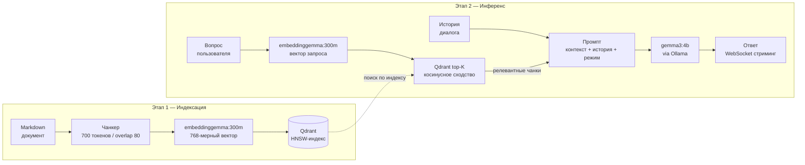

Вот исходный код диаграммы — копируй в [mermaid.live](https://mermaid.live) или вставляй в Figma/pptx:

```mermaid
flowchart LR
  subgraph IND ["Этап 1 — Индексация"]
    direction LR
    A["Markdown\nдокумент"] --> B["Чанкер\n700 токенов / overlap 80"]
    B --> C["embeddinggemma:300m\n768-мерный вектор"]
    C --> D[("Qdrant\nHNSW-индекс")]
  end

  subgraph INF ["Этап 2 — Инференс"]
    direction LR
    E["Вопрос\nпользователя"] --> F["embeddinggemma:300m\nвектор запроса"]
    F --> G["Qdrant top-K\nкосинусное сходство"]
    H["История\nдиалога"] --> I
    G -->|"релевантные чанки"| I["Промпт\nконтекст + история + режим"]
    I --> J["gemma3:4b\nvia Ollama"]
    J --> K["Ответ\nWebSocket стриминг"]
  end

  D -.->|"поиск по индексу"| G
```